# npm dependencies

```mermaid
graph LR;
  arborist-->bin-links;
  arborist-->cacache;
  arborist-->eslint-config["@npmcli/eslint-config"];
  arborist-->installed-package-contents["@npmcli/installed-package-contents"];
  arborist-->map-workspaces["@npmcli/map-workspaces"];
  arborist-->metavuln-calculator["@npmcli/metavuln-calculator"];
  arborist-->move-file["@npmcli/move-file"];
  arborist-->name-from-folder["@npmcli/name-from-folder"];
  arborist-->node-gyp["@npmcli/node-gyp"];
  arborist-->nopt;
  arborist-->npm-install-checks;
  arborist-->npm-package-arg;
  arborist-->npm-registry-fetch;
  arborist-->npmlog;
  arborist-->package-json["@npmcli/package-json"];
  arborist-->pacote;
  arborist-->parse-conflict-json;
  arborist-->proc-log;
  arborist-->read-package-json-fast;
  arborist-->readdir-scoped-modules;
  arborist-->run-script["@npmcli/run-script"];
  arborist-->semver;
  arborist-->ssri;
  arborist-->template-oss["@npmcli/template-oss"];
  arborist-->treeverse;
  bin-links-->cmd-shim;
  bin-links-->npm-normalize-package-bin;
  bin-links-->read-cmd-shim;
  bin-links-->write-file-atomic;
  cacache-->fs-minipass;
  cacache-->fs["@npmcli/fs"];
  cacache-->infer-owner;
  cacache-->move-file["@npmcli/move-file"];
  cacache-->ssri;
  cacache-->unique-filename;
  config-->ini;
  config-->map-workspaces["@npmcli/map-workspaces"];
  config-->nopt;
  config-->proc-log;
  config-->read-package-json-fast;
  config-->semver;
  dezalgo-->wrappy;
  fs-->semver;
  git-->proc-log;
  git-->promise-spawn["@npmcli/promise-spawn"];
  git-->semver;
  init-package-json-->npm-package-arg;
  init-package-json-->promzard;
  init-package-json-->read-package-json;
  init-package-json-->read;
  init-package-json-->semver;
  init-package-json-->validate-npm-package-name;
  installed-package-contents-->npm-bundled;
  installed-package-contents-->npm-normalize-package-bin;
  libnpmaccess-->eslint-config["@npmcli/eslint-config"];
  libnpmaccess-->npm-package-arg;
  libnpmaccess-->npm-registry-fetch;
  libnpmaccess-->template-oss["@npmcli/template-oss"];
  libnpmfund-->arborist["@npmcli/arborist"];
  libnpmfund-->eslint-config["@npmcli/eslint-config"];
  libnpmfund-->template-oss["@npmcli/template-oss"];
  libnpmhook-->eslint-config["@npmcli/eslint-config"];
  libnpmhook-->npm-registry-fetch;
  libnpmhook-->template-oss["@npmcli/template-oss"];
  libnpmorg-->eslint-config["@npmcli/eslint-config"];
  libnpmorg-->npm-registry-fetch;
  libnpmorg-->template-oss["@npmcli/template-oss"];
  libnpmpack-->eslint-config["@npmcli/eslint-config"];
  libnpmpack-->npm-package-arg;
  libnpmpack-->pacote;
  libnpmpack-->run-script["@npmcli/run-script"];
  libnpmpack-->template-oss["@npmcli/template-oss"];
  libnpmpublish-->eslint-config["@npmcli/eslint-config"];
  libnpmpublish-->libnpmpack;
  libnpmpublish-->normalize-package-data;
  libnpmpublish-->npm-package-arg;
  libnpmpublish-->npm-registry-fetch;
  libnpmpublish-->semver;
  libnpmpublish-->ssri;
  libnpmpublish-->template-oss["@npmcli/template-oss"];
  libnpmsearch-->eslint-config["@npmcli/eslint-config"];
  libnpmsearch-->npm-registry-fetch;
  libnpmsearch-->template-oss["@npmcli/template-oss"];
  libnpmteam-->eslint-config["@npmcli/eslint-config"];
  libnpmteam-->npm-registry-fetch;
  libnpmteam-->template-oss["@npmcli/template-oss"];
  libnpmversion-->eslint-config["@npmcli/eslint-config"];
  libnpmversion-->git["@npmcli/git"];
  libnpmversion-->proc-log;
  libnpmversion-->run-script["@npmcli/run-script"];
  libnpmversion-->semver;
  libnpmversion-->stringify-package;
  libnpmversion-->template-oss["@npmcli/template-oss"];
  make-fetch-happen-->cacache;
  make-fetch-happen-->minipass-fetch;
  make-fetch-happen-->ssri;
  map-workspaces-->name-from-folder["@npmcli/name-from-folder"];
  map-workspaces-->read-package-json-fast;
  metavuln-calculator-->cacache;
  metavuln-calculator-->pacote;
  metavuln-calculator-->semver;
  nopt-->abbrev;
  normalize-package-data-->hosted-git-info;
  normalize-package-data-->semver;
  npm-->abbrev;
  npm-->arborist["@npmcli/arborist"];
  npm-->cacache;
  npm-->ci-detect["@npmcli/ci-detect"];
  npm-->config["@npmcli/config"];
  npm-->eslint-config["@npmcli/eslint-config"];
  npm-->fs["@npmcli/fs"];
  npm-->hosted-git-info;
  npm-->ini;
  npm-->init-package-json;
  npm-->libnpmaccess;
  npm-->libnpmfund;
  npm-->libnpmhook;
  npm-->libnpmorg;
  npm-->libnpmpack;
  npm-->libnpmpublish;
  npm-->libnpmsearch;
  npm-->libnpmteam;
  npm-->libnpmversion;
  npm-->make-fetch-happen;
  npm-->map-workspaces["@npmcli/map-workspaces"];
  npm-->nopt;
  npm-->npm-audit-report;
  npm-->npm-install-checks;
  npm-->npm-package-arg;
  npm-->npm-profile;
  npm-->npm-registry-fetch;
  npm-->npm-user-validate;
  npm-->npmlog;
  npm-->package-json["@npmcli/package-json"];
  npm-->pacote;
  npm-->parse-conflict-json;
  npm-->proc-log;
  npm-->read-package-json-fast;
  npm-->read-package-json;
  npm-->read;
  npm-->readdir-scoped-modules;
  npm-->run-script["@npmcli/run-script"];
  npm-->semver;
  npm-->ssri;
  npm-->template-oss["@npmcli/template-oss"];
  npm-->treeverse;
  npm-->validate-npm-package-name;
  npm-->write-file-atomic;
  npm-bundled-->npm-normalize-package-bin;
  npm-install-checks-->semver;
  npm-package-arg-->hosted-git-info;
  npm-package-arg-->semver;
  npm-package-arg-->validate-npm-package-name;
  npm-packlist-->ignore-walk;
  npm-packlist-->npm-bundled;
  npm-packlist-->npm-normalize-package-bin;
  npm-profile-->npm-registry-fetch;
  npm-profile-->proc-log;
  npm-registry-fetch-->make-fetch-happen;
  npm-registry-fetch-->minipass-fetch;
  npm-registry-fetch-->npm-package-arg;
  npm-registry-fetch-->proc-log;
  npmlog-->are-we-there-yet;
  npmlog-->gauge;
  pacote-->cacache;
  pacote-->fs-minipass;
  pacote-->git["@npmcli/git"];
  pacote-->infer-owner;
  pacote-->installed-package-contents["@npmcli/installed-package-contents"];
  pacote-->npm-package-arg;
  pacote-->npm-packlist;
  pacote-->npm-registry-fetch;
  pacote-->proc-log;
  pacote-->promise-spawn["@npmcli/promise-spawn"];
  pacote-->read-package-json-fast;
  pacote-->read-package-json;
  pacote-->run-script["@npmcli/run-script"];
  pacote-->ssri;
  promise-spawn-->infer-owner;
  promzard-->read;
  read-->mute-stream;
  read-package-json-->normalize-package-data;
  read-package-json-->npm-normalize-package-bin;
  read-package-json-fast-->npm-normalize-package-bin;
  readdir-scoped-modules-->dezalgo;
  run-script-->node-gyp["@npmcli/node-gyp"];
  run-script-->promise-spawn["@npmcli/promise-spawn"];
  run-script-->read-package-json-fast;
  template-oss-->fs["@npmcli/fs"];
  template-oss-->git["@npmcli/git"];
  template-oss-->hosted-git-info;
  template-oss-->map-workspaces["@npmcli/map-workspaces"];
  template-oss-->npm-package-arg;
  template-oss-->package-json["@npmcli/package-json"];
  template-oss-->proc-log;
  template-oss-->semver;
  unique-filename-->unique-slug;
```

## npm dependency heirarchy

These are the groups of dependencies in npm that depend on each other.
Each group depends on packages lower down the chain, nothing depends on
packages higher up the chain.

 - npm
 - libnpmfund
 - @npmcli/arborist, libnpmpublish
 - @npmcli/metavuln-calculator, libnpmpack
 - pacote, libnpmaccess, libnpmhook, libnpmorg, libnpmsearch, libnpmteam, npm-profile
 - npm-registry-fetch, libnpmversion
 - make-fetch-happen, @npmcli/template-oss, @npmcli/config, init-package-json
 - @npmcli/installed-package-contents, @npmcli/map-workspaces, cacache, @npmcli/git, @npmcli/run-script, npm-packlist, read-package-json, readdir-scoped-modules, promzard
 - npm-bundled, read-package-json-fast, @npmcli/fs, unique-filename, @npmcli/promise-spawn, npm-package-arg, normalize-package-data, bin-links, nopt, npm-install-checks, npmlog, dezalgo, read
 - npm-normalize-package-bin, @npmcli/name-from-folder, semver, @npmcli/move-file, fs-minipass, infer-owner, ssri, unique-slug, proc-log, @npmcli/node-gyp, hosted-git-info, validate-npm-package-name, ignore-walk, minipass-fetch, @npmcli/package-json, cmd-shim, read-cmd-shim, write-file-atomic, abbrev, are-we-there-yet, gauge, parse-conflict-json, wrappy, treeverse, @npmcli/eslint-config, stringify-package, @npmcli/ci-detect, ini, mute-stream, npm-audit-report, npm-user-validate